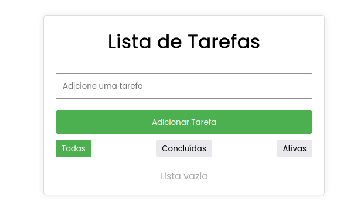
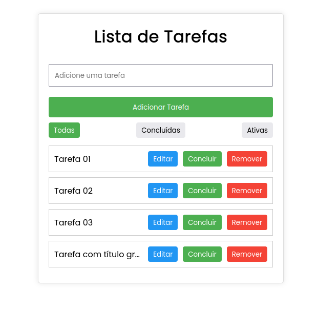
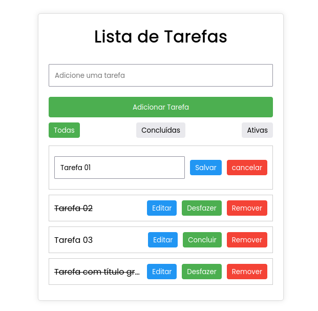

# Aplicação de Lista de Tarefas em React

Este é um desafio básico que deve ser feito utilizando somente o ReactJS. O objetivo é criar uma aplicação de lista de tarefas simples usando React, sem libs adicionais,  permitindo que os usuários adicionem, removam, editem e filtrem tarefas.

## Início

1. Clone o repositório.
2. Instale as dependências usando `npm install` ou `yarn install`.
3. Execute a aplicação usando `npm start` ou `yarn start`.
4. Implemente os componentes conforme especificado no desafio.
5. Estilize a aplicação para garantir uma experiência de usuário agradável.
6. Adicione funcionalidades adicionais ou melhorias como bônus, se desejar, lembrando que o importante são as principais funcionalidades do CRUD.

## Requisitos

1. A aplicação deve permitir a adição de novas tarefas.
2. Os usuários devem ser capazes de marcar tarefas como concluídas e desfazer essa ação.
3. Deve haver a opção de remover tarefas da lista.
4. Os usuários devem ser capazes de editar o título das tarefas.
5. A aplicação deve permitir a filtragem de tarefas por estado (todas/concluídas/não concluídas).

## Imagens de apoio 
1. 
2. 
3. 

## Critérios

- A aplicação deve funcionar corretamente de acordo com os requisitos especificados.
- O código deve ser claro, legível e seguir as boas práticas de desenvolvimento.
- Os componentes devem ser bem estruturados e reutilizáveis sempre que possível.
- A interface de usuário deve ser intuitiva e responsiva.
- A aplicação deve ser estilizada de forma agradável ao usuário.
- Funcionalidades extras ou melhorias serão consideradas como bônus.
- Certifique-se de documentar quaisquer decisões ou considerações importantes no README.

## Recursos Adicionais

Além dos requisitos, você pode adicionar funcionalidades adicionais, como persistência de dados, testes de unidade, animações e transições, paginação, para melhorar a qualidade e a experiência do usuário da aplicação.
